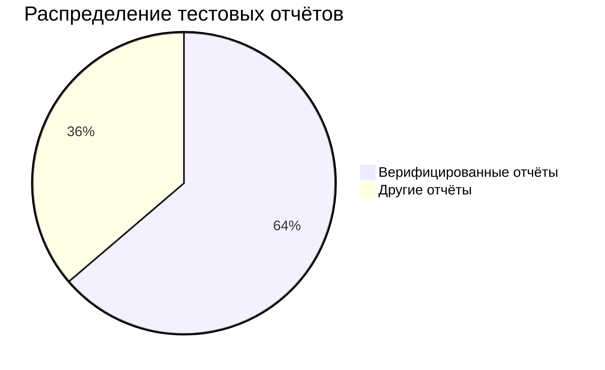
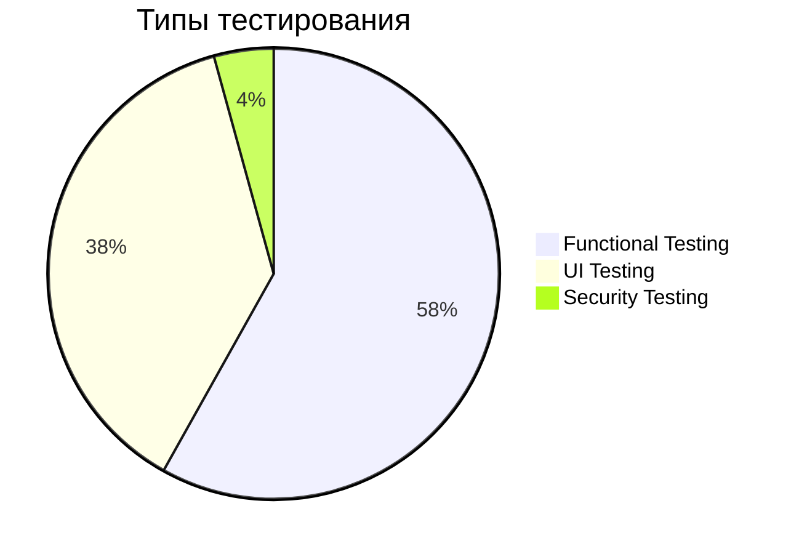

# QA Portfolio

Добро пожаловать в моё QA-портфолио.

В данном репозитории представлены примеры тестовой документации, созданной в процессе практического тестирования веб-приложений.

Здесь собраны баг-репорты и отчёты по различным направлениям тестирования:

- функциональное тестирование;
- UI-тестирование;
- security-тестирование;
- проверка пользовательского опыта.

Все отчёты оформлены в формате, приближенном к рабочей документации QA-инженера: описание проблемы, шаги воспроизведения, фактический и ожидаемый результат.

---

## Структура проекта

```
QA-Portfolio
│
├── test-cases
│   │
│   ├── functional
│   │   └── Функциональные баг-репорты и улучшения
│   │
│   ├── security
│   │   └── Отчёты по найденным уязвимостям
│   │
│   └── ui
│       └── UI-баги и проблемы отображения
│
└── README.md
```

---

## Типы проверок

### Functional Testing

Проверка корректности работы функциональности приложения:

- формы;
- сохранение данных;
- пользовательские сценарии;
- бизнес-логика.

### UI Testing

Проверка интерфейса:

- отображение элементов;
- адаптивность;
- локализация;
- удобство взаимодействия.

### Security Testing

Проверка безопасности приложения:

- XSS-уязвимости;
- обработка пользовательского ввода;
- потенциальные проблемы безопасности.

---

## Формат отчётов

Каждый отчёт содержит:

- описание проблемы;
- шаги воспроизведения;
- фактический результат;
- ожидаемый результат;
- дополнительную информацию при необходимости.

---

## Цель проекта

Цель данного репозитория — продемонстрировать навыки поиска, анализа и документирования дефектов, а также умение оформлять результаты тестирования в структурированном виде.

## Статистика

| Показатель | Количество |
|---|---:|
| Всего отчётов | 113 |
| Верифицированных отчётов | 72 |
| Разделов тестирования | 3 |

---

## Распределение отчётов



---

## Категории тестирования


